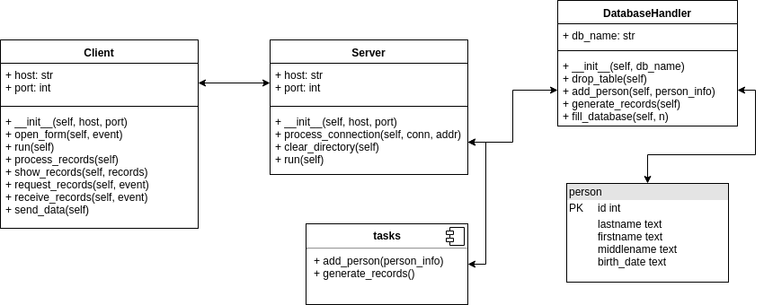

# tkinter-rest-celery-py2

Simple client-server app

# Components



# Requirements

The app depends on the next packages:

* names
* celery
* RabbitMQ
* Tkinter

The first one and the second one may be installed by bash (checked for Ubuntu-18.04-based OS):

```bash
pip install -r requirements.txt --user
```

The RabbitMQ may be installed by the next way according to [Tests4geeks Blog](https://tests4geeks.com/python-celery-rabbitmq-tutorial/).

```bash
$ apt-get install rabbitmq-server
# add user 'jimmy' with password 'jimmy123'
$ rabbitmqctl add_user jimmy jimmy123
# add virtual host 'jimmy_vhost'
$ rabbitmqctl add_vhost jimmy_vhost
# add user tag 'jimmy_tag' for user 'jimmy'
$ rabbitmqctl set_user_tags jimmy jimmy_tag
# set permission for user 'jimmy' on virtual host 'jimmy_vhost'
$ rabbitmqctl set_permissions -p jimmy_vhost jimmy ".*" ".*" ".*"
```

The Tkinter may be installed by:

```bash
$ apt-get install python-tk
```

# Run

To run the app from the project root directory:

1. `celery -A tasks worker --loglevel=info`
2. `python server/server.py`
3. `python client/client.py`

**Note**: server and client may be run in random order
